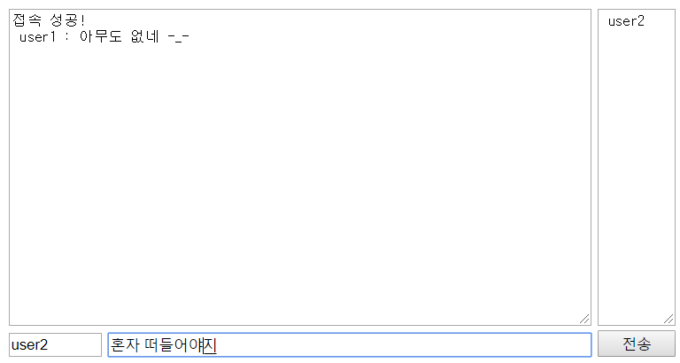
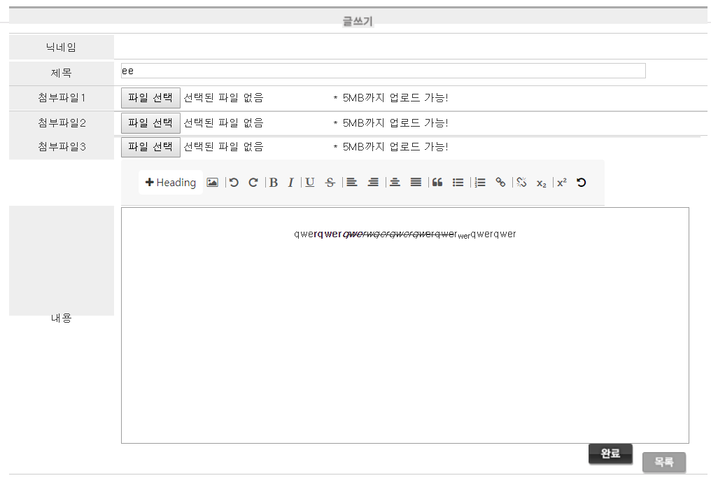
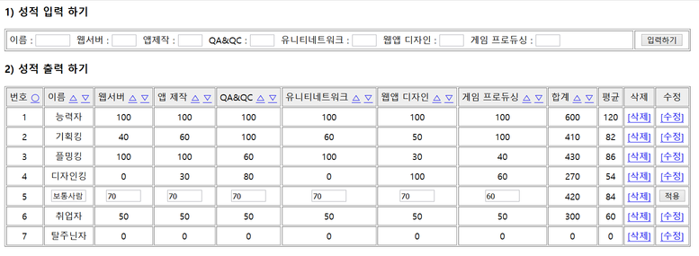
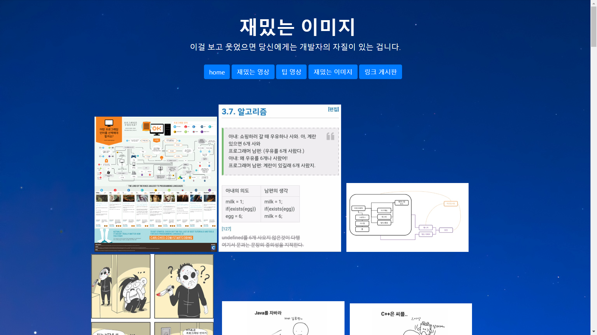
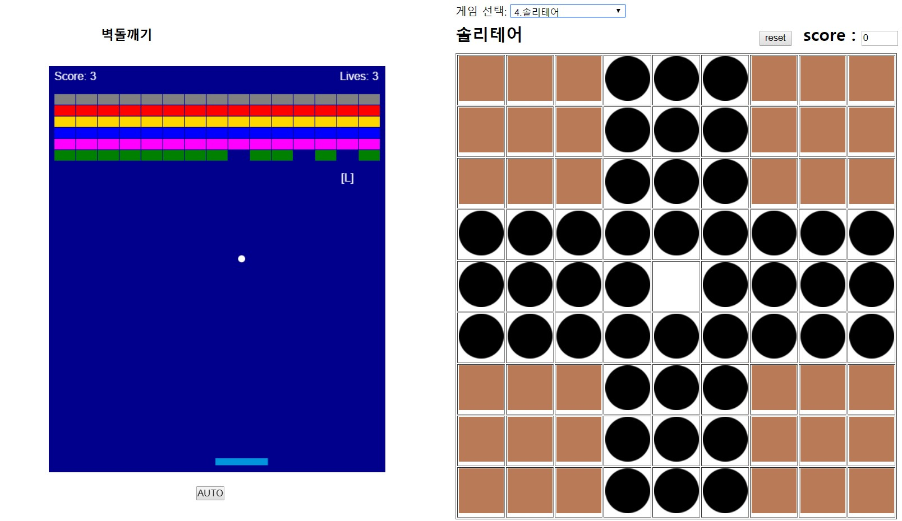
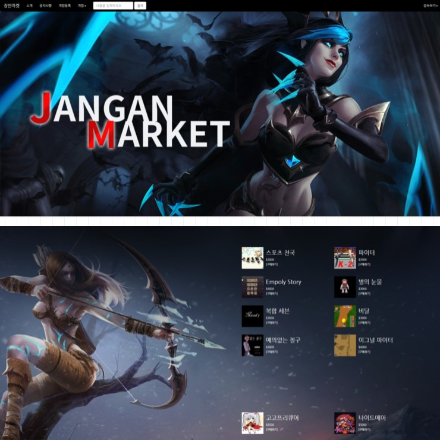
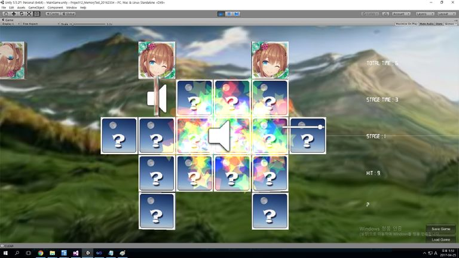

포트폴리오
  

제목 : 익명 채팅  
제작 년도 : 2019  
설명 : ajax와 mysql을 연동한 간단한 채팅  
팀원 : 개인 프로젝트  
주요기능 :  
-접속 성공/실패 확인  
-채팅(닉네임, 메시지 전송)  
-접속자 목록  
  
소스 링크 :  
https://github.com/wjdskagjs1/chat
  

제목 : 게시판  
제작 년도 : 2019  
설명 : php, mysql을 연동한 게시판.  
팀원 : 개인 프로젝트  
주요기능 :  
-게시글 작성, 답게시글 작성, 답답게시글 작성 기능  
-첨부파일 기능  
-같은 그룹끼리는 ord가 오름차순으로 정렬  
-게시판 에디터 연동  
  
소스 링크 :  
https://drive.google.com/open?id=1fRyhwUSDmJyUR27ssobGwGjvCu1D7s1j
  

제목 : stud_score  
제작 년도 : 2019  
설명 : php와 mysql을 연동한 성적처리 프로그램  
팀원 : 개인 프로젝트  
주요기능 :  
-성적 조회, 입력, 수정, 삭제  
-성적별 오름차순/내림차순 정렬 기능  
-세션 변수를 이용한 mysql 아이디/비밀번호 체크  
-접속 PC와 ip 출력  
  
소스 링크 :  
https://drive.google.com/open?id=1D5o8uiLqRx55PghlRlQhJZEIQzNP2We6
  

제목 : fact factory  
제작 년도 : 2019  
설명 : php를 기반으로 제작한 홈페이지. 후배들에게 보여주고 싶은 영상, 이미지, 링크를 모아둔 사이트.  
팀원 : 개인 프로젝트  
주요기능 :  
-유튜브 영상 링크 DB table  
-이미지 갤러리  
-링크 DB table  
-반응형 웹페이지  
  
링크 :  
http://factfactory.dothome.co.kr/  
https://drive.google.com/open?id=1V98UPjGupGj95nMWHBea_SC3Lz-4wLS2  

제목 : simple JS game collection  
제작 년도 : 2019  
설명 : 간단한 자바스크립트 게임들을 모아둔 사이트.  
팀원 : 개인 프로젝트  
주요기능 :  
-1. 베스킨라빈스 31 게임  
-2. 경마게임  
-3. 벽돌깨기 게임  
-4. One Left  
  
소스 링크 :  
https://github.com/wjdskagjs1/simplejsgame/  
https://wjdskagjs1.github.io/simplejsgame/  

제목 : 장안 마켓  
제작 년도 : 2017  
설명 : 다른 게임 동아리에서 제작한 게임을 판매하는 php 기반 웹사이트.  
팀원 : 성건희, 이가형, 오민섭, 정남헌  
역할 :  
-공지사항 게시판 제작  
-댓글 기능 제작  
-답댓글 기능 제작  
  
소스 링크 : https://drive.google.com/open?id=12mfNAYVjf1JtYnr2t2Rc4Z3RMXqLPE1g
  

제목 : MemoryTest upgrade  
제작 년도 : 2017  
설명 : 유니티로 제작된 3장 짝맞추기 게임  
팀원 : 개인 프로젝트  
주요기능 :   
-3장 카드 맞추기로   UPGRADE  
-STAGE 증가시 게임시간 5초씩   감소시키기.  
-게임시간 진행상태 표시   gauge 만들기  
-BONUS 카드 부여하기  
-현재 게임 상태   save  
-저장된 게임 load 하기  
  
소스 링크 : https://github.com/wjdskagjs1/MemoryTest  