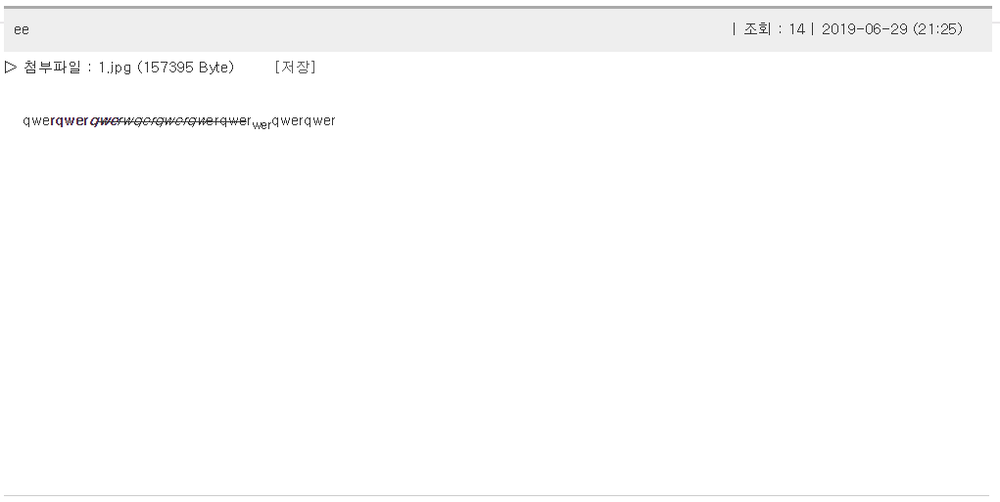

포트폴리오

제목 : 익명 채팅
제작 년도 : 2019
설명 : ajax와 mysql을 연동한 간단한 채팅
팀원 : 개인 프로젝트
주요기능 :
-접속 성공/실패 확인
-채팅(닉네임, 메시지 전송)
-접속자 목록

소스 링크 :
https://github.com/wjdskagjs1/chat

제목 : 게시판
제작 년도 : 2019
설명 : php, mysql을 연동한 게시판.
팀원 : 개인 프로젝트
주요기능 :
-게시글 작성, 답게시글 작성, 답답게시글 작성 기능
-첨부파일 기능
-같은 그룹끼리는 ord가 오름차순으로 정렬
-게시판 에디터 연동

소스 링크 :
https://drive.google.com/open?id=1fRyhwUSDmJyUR27ssobGwGjvCu1D7s1j

제목 : stud_score
제작 년도 : 2019
설명 : php와 mysql을 연동한 성적처리 프로그램
팀원 : 개인 프로젝트
주요기능 :
-성적 조회, 입력, 수정, 삭제
-성적별 오름차순/내림차순 정렬 기능
-세션 변수를 이용한 mysql 아이디/비밀번호 체크
-접속 PC와 ip 출력

소스 링크 :
https://drive.google.com/open?id=1D5o8uiLqRx55PghlRlQhJZEIQzNP2We6

제목 : fact factory
제작 년도 : 2019
설명 : php를 기반으로 제작한 홈페이지. 후배들에게 보여주고 싶은 영상, 이미지, 링크를 모아둔 사이트.
팀원 : 개인 프로젝트
주요기능 :
-유튜브 영상 링크 DB table
-이미지 갤러리
-링크 DB table
-반응형 웹페이지

링크 :
http://factfactory.dothome.co.kr/
https://drive.google.com/open?id=1V98UPjGupGj95nMWHBea_SC3Lz-4wLS2

제목 : simple JS game collection
제작 년도 : 2019
설명 : 간단한 자바스크립트 게임들을 모아둔 사이트.
팀원 : 개인 프로젝트
주요기능 :
-1. 베스킨라빈스 31 게임
-2. 경마게임
-3. 벽돌깨기 게임
-4. One Left

소스 링크 :
https://github.com/wjdskagjs1/simplejsgame/
https://wjdskagjs1.github.io/simplejsgame/

제목 : 장안 마켓
제작 년도 : 2017
설명 : 다른 게임 동아리에서 제작한 게임을 판매하는 php 기반 웹사이트.
팀원 : 성건희, 이가형, 오민섭, 정남헌
역할 :
-공지사항 게시판 제작
-댓글 기능 제작
-답댓글 기능 제작

소스 링크 : https://drive.google.com/open?id=12mfNAYVjf1JtYnr2t2Rc4Z3RMXqLPE1g

제목 : MemoryTest upgrade
제작 년도 : 2017
설명 : 유니티로 제작된 3장 짝맞추기 게임
팀원 : 개인 프로젝트
주요기능 : 
-3장 카드 맞추기로   UPGRADE
-STAGE 증가시 게임시간 5초씩   감소시키기.
-게임시간 진행상태 표시   gauge 만들기
-BONUS 카드 부여하기
-현재 게임 상태   save
-저장된 게임 load 하기

소스 링크 : https://github.com/wjdskagjs1/MemoryTest